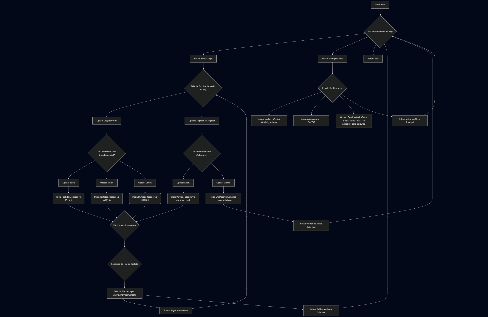
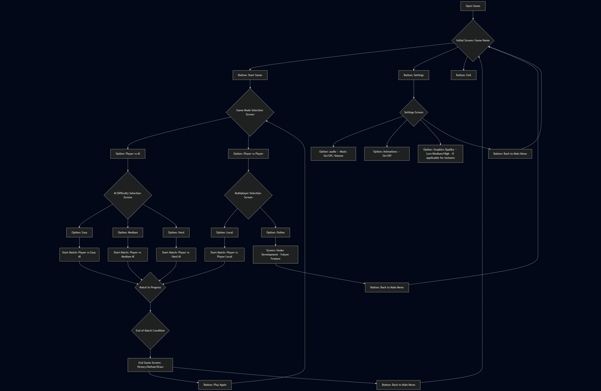

# Python Chess Project
Welcome to our Python chess game repository! This project aims to create a single-player chess game against AI, with various difficulty options, visual customization of pieces, and a future local multiplayer mode.

## 🎯 Project Objective
Develop a complete and functional desktop chess game using Python, with the following main features:
- Single Player Mode: Player vs. AI (Artificial Intelligence).
- Multiple AI Difficulty Levels:
  - Easy/Medium: Custom AI implementation (Minimax with Alpha-Beta Pruning and custom evaluation function).
  - Hard: Integration with Stockfish chess engine.
- Visual Customization: Using PNG sprites for pieces and board.
- Local Multiplayer Mode: Two players on the same computer (future).
- Intuitive Graphical Interface: Using Pygame.

## 🚀 Technologies Used
- Python 3.x: Main programming language.
- Pygame: Library for game development and graphical interface.
- python-chess: Library for chess game logic (moves, validations, board state).
- Stockfish: Open-source chess engine (for "Hard" difficulty mode).

## 📂 Project Structure
The folder structure was designed for modularity and collaboration:
```plain_text
ai-chess-game/
├── src/             # Main game source code
│   ├── core/        # Game logic (ChessGame, GameManager)
│   ├── ui/          # Interface (BoardRenderer, UIManager, UI elements)
│   ├── ia/          # Artificial Intelligence (EasyAI, MediumAI, StockfishAI)
│   └── data/        # Save/Load, configurations
├── assets/          # Images (PNGs), sounds
│   ├── pieces/      # Piece sprites (ex: `white_pawn.png`, `black_king.png`)
│   ├── board/       # Board images (if any)
│   └── audio/       # Sounds, music
├── engines/         # Stockfish executable (will be downloaded here)
├── docs/            # Project documentation, README.md
├── readme-files/    # Files to readme
├── .gitignore       # To ignore temporary files, builds, etc.
├── requirements.txt # Python dependencies list
└── main.py          # Game entry point
└── README.md        # This file
```

## 🛠️ Environment Setup and Installation
Follow the steps below to configure your development environment and install dependencies.

**Prerequisites**
- Python 3.x installed (we recommend Python 3.8 or higher).
- Git installed.

**Installation Steps**
1. Clone the Repository:
```bash
git clone https://github.com/lucasgleria/ai-chess-game.git
cd ai-chess-game
```
2. Create and Activate a Virtual Environment:
```bash
python -m venv venv
# On Windows:
.\venv\Scripts\activate
# On macOS/Linux:
source venv/bin/activate
```
3. Install Dependencies:
```bash
pip install -r requirements.txt
```
4. Download Stockfish (for "Hard" AI):
- Go to the official Stockfish website: https://stockfishchess.org/download/
- Download the version compatible with your operating system.
- Extract the Stockfish executable (ex: stockfish.exe on Windows, stockfish on Linux/macOS) and place it in the engines/ folder within your project.

## Game Flow

```
graph TD
    A[Open Game] --> B{Initial Screen: Game Name}

    B --> C[Button: Start Game]
    B --> D[Button: Settings]
    B --> E[Button: Exit]

    C --> F{Game Mode Selection Screen}
    F --> G[Option: Player vs AI]
    F --> H[Option: Player vs Player]

    G --> I{AI Difficulty Selection Screen}
    I --> J[Option: Easy]
    I --> K[Option: Medium]
    I --> L[Option: Hard]

    J --> M(Start Match: Player vs Easy AI)
    K --> N(Start Match: Player vs Medium AI)
    L --> O(Start Match: Player vs Hard AI)

    M --> P{Match in Progress}
    N --> P
    O --> P

    P --> Q{End of Match Condition}
    Q --> R[End Game Screen: Victory/Defeat/Draw]
    R --> S[Button: Play Again]
    R --> T[Button: Back to Main Menu]

    H --> U{Multiplayer Selection Screen}
    U --> V[Option: Local]
    U --> W[Option: Online]

    V --> X(Start Match: Player vs Player Local)
    X --> P

    W --> Y[Screen: Under Development - Future Feature]
    Y --> Z[Button: Back to Main Menu]

    D --> AA{Settings Screen}
    AA --> BB[Option: audio -- Music On/Off, Volume]
    AA --> CC[Option: Animations -- On/Off]
    AA --> DD[Option: Graphics Quality -- Low/Medium/High - if applicable for textures]
    AA --> EE[Button: Back to Main Menu]

    S --> F
    T --> B
    Z --> B
    EE --> B
```
_Portuguese:_


_English:_


## 🤝 Contribution

Contributions are welcome! Follow these steps:

### **1. Report Bugs**
- Open an [issue](https://github.com/lucasgleria/ai-chess-game/issues) on GitHub
- Describe the problem in detail
- Include logs and screenshots if possible

### **2. Suggest Improvements**
- Submit ideas through issues
- Propose new features
- Discuss architectural improvements

### **3. Develop**
- Fork the project
- Create a branch (`git checkout -b feature/new-feature`)
- Make your changes following the project standards
- Add tests for new features
- Commit (`git commit -m ‘feat: new feature’)
- Send a Pull Request

## 📞 Contact
  - **Author**: [Lucas Leria](https://www.google.com/search?q=https://github.com/lucasgleria)
  - **Co-Author**: [Hamza Nouman](https://www.google.com/search?q=https://github.com/HamzaNouman)
  - **Co-Author**: [Eduardo Antônio](https://www.google.com/search?q=https://github.com/eduhantonio)
