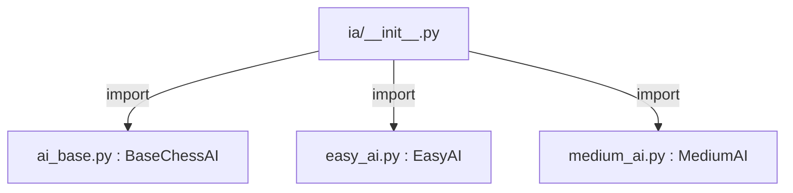

# 📝 Other Additions and Developer Notes

This document is intended for developers to record any additions, changes, or observations that are not part of the main project planning. Each developer (A, B, and C) has a dedicated section below. Please use your section to document anything relevant that should be tracked for future reference or team awareness.

---

## Section for Developer A

- _Add your notes, additions, or changes here._

---

## Section for Developer B

- _Add your notes, additions, or changes here._

---

## Section for Developer C

- **Automated test environment setup:**
  - Added the `pytest.ini` file at the root of the project to ensure that the `src` directory is automatically included in the PYTHONPATH during test execution. This standardizes the environment for all developers and eliminates the need for manual adjustments to sys.path or environment variables.

- **Standardization of imports in tests:**
  - Imports in the test files have been adjusted to use the path relative to the `src` directory (e.g., `from ia.easy_ai import EasyAI`), ensuring compatibility with the `pytest.ini` configuration and making project maintenance easier.

- **Modular test structure:**
  - The AI tests have been centralized in a single file (`tests/test_ai.py`), using the `pytest` framework and fixtures to facilitate the expansion and maintenance of tests.

- **Documentation and guidance for new developers:**
  - The above decisions were made to simplify onboarding for new devs and ensure that everyone can run the tests in a simple and standardized way, just by executing `pytest tests/` at the project root.

- **Refactoring of the IA package (`src/ia/__init__.py`):**
  - Placeholder classes were removed from the `__init__.py` file of the `ia` package.
  - Imports of the real implementations of `BaseChessAI`, `EasyAI`, and `MediumAI` were centralized directly in `__init__.py`, allowing other modules to import the main AI classes directly from the `ia` package.
  - The `__all__` variable was updated to reflect only the available real implementations.
  - This change makes the package cleaner, more robust, and aligned with good Python modularization practices.

- **Visual diagram of IA file interaction:**

Run in: https://mermaid.live/

- **Why doing this?**  
Now  you can import in any part of the project the AI's  
- E.g:
```python
from ia import EasyAI, MediumAI, BaseChessAI
```
---
